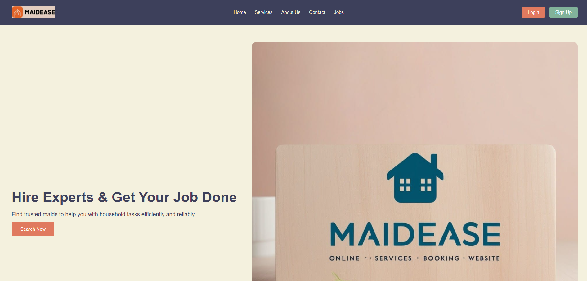

# MaidEase

## Overview
MaidEase is an online platform designed to connect users with domestic helpers. Inspired by UrbanClap, it allows users to easily find and book maids for various services. The platform also empowers users with bargaining power, similar to InDriver, and includes a reviews section for both helpers and users to maintain transparency and trust.

## Features
- **User-Friendly Interface**: Simple and intuitive design to help users navigate the platform and book services with ease.
- **Service Listings**: Browse through a wide range of services provided by domestic helpers, including cleaning, cooking, babysitting, and more.
- **Bargaining Power**: Users can negotiate prices with helpers to ensure fair and competitive rates.
- **Rating and Reviews**: Both helpers and users can leave reviews and ratings, fostering a trustworthy community.
- **Secure Payment Gateway**: Secure and convenient payment options to complete transactions.
- **Booking History**: Track past bookings and easily repeat services.
- **Customer Support**: Dedicated support to assist users with any issues or inquiries.

## Technology Stack
- **Frontend**: HTML, CSS

## Glimpse of MaidEase

